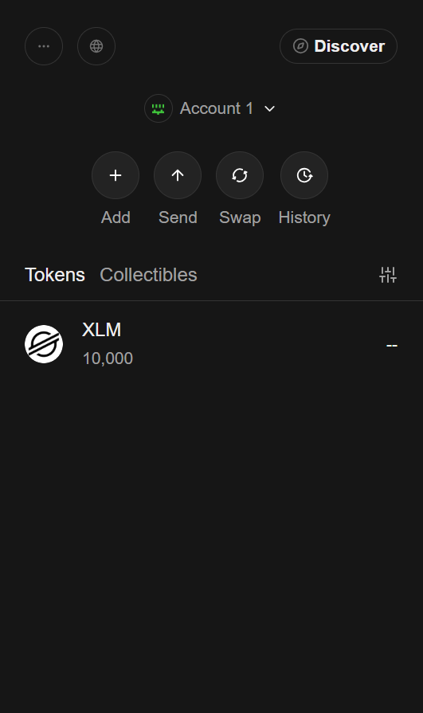
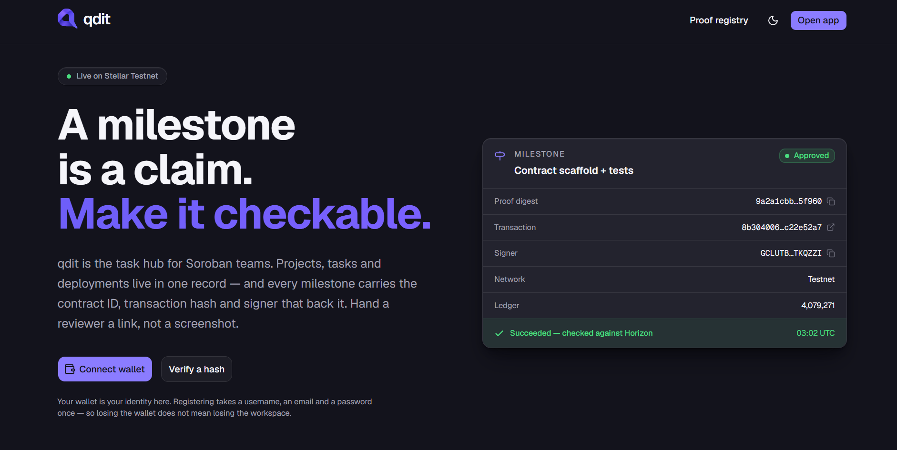
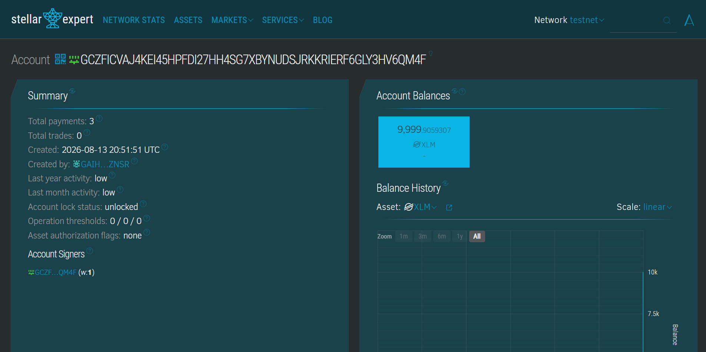
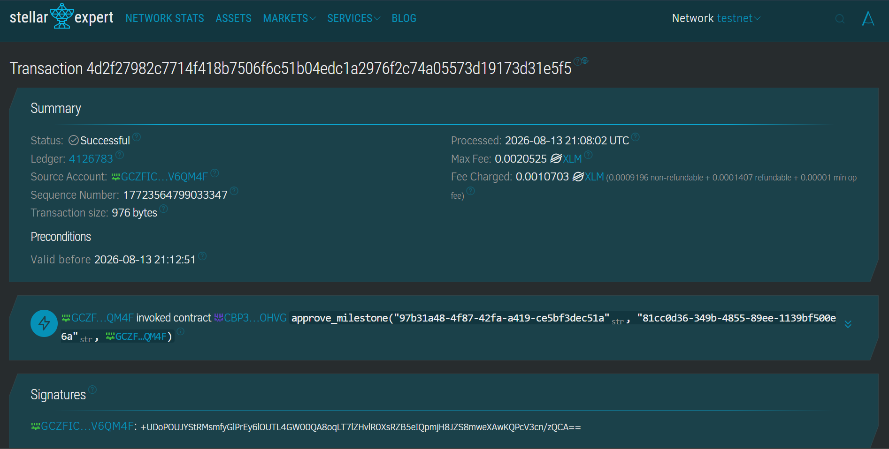

# qdit

Builder operations for Stellar teams — a lightweight task hub that keeps project
management and on-chain proof of work in the same record.

Tasks, milestones and deployment status live in Postgres. Milestone proofs are
anchored on-chain through a small Soroban contract, signed by the user's own
wallet.

- Product spec: [`stellar-builder-task-hub-spec.md`](./stellar-builder-task-hub-spec.md)
- Design language: [`qdit-design-language-spec.md`](./qdit-design-language-spec.md)
- Anchoring methodology: [`SMART_CONTRACT_SPEC.md`](./SMART_CONTRACT_SPEC.md)
- What is still missing: [`gaps.md`](./gaps.md)

## Layout

```
web/         Next.js 16 app (App Router, TypeScript, Tailwind v4, shadcn/ui)
contracts/   Rust workspace — the milestone_proof Soroban contract
supabase/    SQL migrations, RLS policies, local config
materials/   Brand source material
```

## Quick start — run it locally

**Prerequisites**

| Need | Why |
| --- | --- |
| Node.js 20.9+ and npm | Next.js 16 |
| A Supabase project, or the [Supabase CLI](https://supabase.com/docs/guides/cli) for a local stack | every read and write goes through Postgres with RLS |
| [Freighter](https://www.freighter.app/) set to **Stellar Testnet** | sign-in, anchoring and payments are wallet-signed |
| Rust + [Stellar CLI](https://developers.stellar.org/docs/tools/cli) — optional | only to build or redeploy the contract |

**Run the app**

```bash
git clone https://github.com/TyronVT/qdit.git
cd qdit/web                    # install from web/, not the repo root
cp .env.example .env.local     # fill in your Supabase project values
npm install
npm run dev                    # http://127.0.0.1:3000
```

`npm install` from the repo root *appears* to work, because Node resolves
upward. Install from `web/`.

**What `.env.local` needs**

| Variable | Value |
| --- | --- |
| `NEXT_PUBLIC_SUPABASE_URL` | Supabase project URL |
| `NEXT_PUBLIC_SUPABASE_PUBLISHABLE_KEY` | publishable key — RLS is what protects the data, not this key |
| `NEXT_PUBLIC_SITE_URL` | `http://127.0.0.1:3000` locally |
| `NEXT_PUBLIC_STELLAR_NETWORK` | `testnet` |
| `NEXT_PUBLIC_MILESTONE_PROOF_CONTRACT_ID` | `CBP3NKXCRUSOJLLUXDF5AIRNPAC6IL7TFJ2KCNL5A2GTKC2MB7M4OHVG` — **leave empty and anchoring is absent rather than broken** |
| `SUPABASE_SECRET_KEY` | server-only; required for wallet sign-in |
| `STELLAR_AUTH_SERVER_SECRET` | server-only; signs the SEP-10 challenge. An ordinary keypair, generated once and never funded |

Every variable is documented inline in [`web/.env.example`](./web/.env.example).

**Database**

```bash
supabase start           # local stack
supabase db reset        # apply migrations + seed
```

Never apply `seed.sql` to a hosted project — see the security note under
[Database](#database).

**First run**

Open `/login`, connect Freighter, and register a username and email. Fund the
account from Friendbot if it is new, then `/wallet` shows the balance and can
send a Testnet payment.

Other commands: `npm run build`, `npm run lint`, `npm run typecheck`,
`npm test`. Contracts and end-to-end tests have their own sections below.

## Where things stand

All three layers are joined. The UI reads and writes a hosted Postgres with RLS
enforced, and signs Soroban transactions against a contract deployed on Testnet.

| Layer | State |
|---|---|
| Database | 8 tables, 7 enums, triggers, indexes, 30 RLS policies across 11 migrations. Applied to a hosted project and seeded. |
| Contract | 6 functions plus events, 26 tests. Deployed to Testnet and called from the app; `transfer_project_owner` is CLI-only (`gaps.md` §1). |
| Web UI | Full CRUD, role-gated, over real Postgres, plus wallet-signed anchoring and XLM payments. |

| Check | Result |
|---|---|
| `npm run lint`, `npm run typecheck` | pass |
| `npm run build` | pass, with and without a contract id in env |
| `npm test` (Vitest) | 180 passed |
| `npx playwright test` | 140 passed, 1 skipped — not re-run since `/wallet` landed; needs a `.env.local` |
| `cargo test` | 26 passed |
| `cargo clippy --all-targets -- -D warnings`, `cargo fmt --all --check` | clean |
| `stellar contract build` | 10777 bytes, hash `d4bbe221…f2a8b4` |

Working end to end: connect-wallet sign-in, wallet registration, email recovery
sign-in, sign-out and the auth gate; every read; create, edit and delete for
projects, tasks, milestones and proofs; the milestone approval flow; deployment
logging; profile and username; drag-and-drop on the board; transaction
verification against Horizon; and anchoring a milestone's proof hash on chain
with a connected wallet. `/wallet` connects and disconnects a Freighter wallet,
reads its XLM balance from Horizon, and sends a Testnet payment end to end.

## Screenshots — Stellar wallet integration (testnet)

End-to-end wallet flow on **Stellar Testnet**, signed with Freighter and
verified on-chain. Source images live in
[`docs/screenshots/stellar_wallet_integration/`](docs/screenshots/stellar_wallet_integration).

| Field | Value |
| --- | --- |
| Network | Stellar Testnet (`Test SDF Network ; September 2015`) |
| Wallet | [`GCZFICVAJ4KEI45HPFDI27HH4SG7XBYNUDSJRKKRIERF6GLY3HV6QM4F`](https://stellar.expert/explorer/testnet/account/GCZFICVAJ4KEI45HPFDI27HH4SG7XBYNUDSJRKKRIERF6GLY3HV6QM4F) |
| Contract | [`CBP3NKXCRUSOJLLUXDF5AIRNPAC6IL7TFJ2KCNL5A2GTKC2MB7M4OHVG`](https://stellar.expert/explorer/testnet/contract/CBP3NKXCRUSOJLLUXDF5AIRNPAC6IL7TFJ2KCNL5A2GTKC2MB7M4OHVG) |

### 1. Wallet setup

Freighter installed, switched to **Stellar Testnet**, and funded from Friendbot
with **10,000 XLM**.



| Field | Value |
| --- | --- |
| Network | Stellar Testnet |
| Account | [`GCZFICVAJ4KEI45HPFDI27HH4SG7XBYNUDSJRKKRIERF6GLY3HV6QM4F`](https://stellar.expert/explorer/testnet/account/GCZFICVAJ4KEI45HPFDI27HH4SG7XBYNUDSJRKKRIERF6GLY3HV6QM4F) |
| Created | 2026-08-13 20:51:51 UTC (Friendbot) |
| Initial balance | 10,000 XLM |

The app links the same Friendbot for an unfunded account rather than erroring —
`friendbotUrl()` in `src/lib/wallet.ts`, reached from the `funded: false` state.

### 2. Wallet connected

The wallet is the credential: connecting it is how you sign in, and an address
the app has never seen leads to `/register` rather than to a session.



| Behaviour | Code |
| --- | --- |
| **Connect** — opens the kit's chooser, returns the public key | `connectWallet()` in `src/lib/wallet.ts` |
| Challenge exchange — SEP-10 signature → Supabase session | `src/app/api/auth/wallet/` |
| **Disconnect** — drops the kit's stored address; sign-out does both | `disconnectWallet()`, called from `/wallet` and from sign-out |
| Live address changes | `onWalletState()` (kit `STATE_UPDATED` event) |
| Connected address, balance and send form | `/wallet` — `src/app/(app)/wallet/page.tsx` |

The address on `/wallet` is read back from the wallet rather than stored, so the
page cannot claim a connection the extension does not agree with.
`@creit.tech/stellar-wallets-kit` is imported inside each function because it
touches `localStorage` during module evaluation, which breaks server rendering
of client components.

### 3. Balance displayed

The connected account's XLM balance, read from testnet Horizon by
`GET /api/balance` and confirmed on Stellar Expert after the transaction below:



| Field | Value |
| --- | --- |
| Balance | `9,999.9059307 XLM` — 10,000 minus fees for 3 payments |
| Total payments | 3 |
| Reported as | `balance`, `reserve`, `spendable` |

Three figures, not one: the protocol will not let an account drop below a
minimum tied to its subentry count, so `spendable` — balance minus reserve minus
fee headroom — is the only one that answers "how much can I send", and it is the
number the send form enforces. A 404 from Horizon comes back as `funded: false`
rather than an error, because on Testnet that is one Friendbot click from being
funded.

### 4. Successful testnet transaction, and its result

A milestone approval anchored on-chain — `approve_milestone` invoked on the
deployed `milestone_proof` contract, signed in the browser with Freighter:



| Field | Value |
| --- | --- |
| **Status** | ✅ Successful |
| **Transaction hash** | [`4d2f27982c7714f418b7506f6c51b04edc1a2976f2c74a05573d19173d31e5f5`](https://stellar.expert/explorer/testnet/tx/4d2f27982c7714f418b7506f6c51b04edc1a2976f2c74a05573d19173d31e5f5) |
| Ledger | 4126783 |
| Processed | 2026-08-13 21:08:02 UTC |
| Source account | [`GCZFIC…V6QM4F`](https://stellar.expert/explorer/testnet/account/GCZFICVAJ4KEI45HPFDI27HH4SG7XBYNUDSJRKKRIERF6GLY3HV6QM4F) |
| Invoked | `approve_milestone(project_id, milestone_id, approver)` on [`CBP3NKXC…MB7M4OHVG`](https://stellar.expert/explorer/testnet/contract/CBP3NKXCRUSOJLLUXDF5AIRNPAC6IL7TFJ2KCNL5A2GTKC2MB7M4OHVG) |
| Max fee | 0.0020525 XLM |
| Fee charged | 0.0010703 XLM |
| Transaction size | 976 bytes |

**The result is shown back to the user, not just written to a ledger.** Once
`submitMilestoneAnchor` confirms, the milestone keeps its receipt on screen —
proof digest, transaction hash, signer, network, ledger and a
`Succeeded — checked against Horizon` line, with a copy button and a link to the
explorer. The same panel is what the landing page above previews. A transaction
that leaves nothing behind is indistinguishable from one that never happened, so
the hash stays put rather than flashing past in a toast.

Failures are shown the same way. Simulation runs *before* the wallet is asked to
sign, so a contract error surfaces as a message instead of a paid-for failed
transaction, and a rejected signature is reported as a rejection
(`isRejectedError()`) rather than as a crash.

## How it is put together

### Forms

Every create and edit form is built on `src/components/form-dialog.tsx` — one
shell, so pending state, error placement and the close-only-on-success rule
cannot drift between them. Create and edit share one field set per entity in
`entity-dialogs.tsx`. Add a new entity by writing fields, not another dialog.

### Roles

Which controls appear is decided by the caller's role in that project, because
the RLS policies are not uniform: tasks and milestones are open to any member,
projects and deployments to an admin, proofs to their author or an admin. The
server actions re-check — a hidden button is courtesy, not the boundary.

### Adding members

Two paths, because neither covers the other. The picker offers people
`shares_project_with()` already matches — in a single-project workspace that is
nobody, since the visible set *is* the roster — so it cannot grow a team past
whoever was seeded. Typing an identifier reaches anyone with an account, but
means knowing one, and RLS hides a stranger's `profiles` row entirely, so the
picker cannot show anything to jog a memory. Typing is the default; the picker
appears above it only when it has candidates.

**One field takes a username, an email address or a wallet address.** The three
formats cannot collide — a username is `[a-z0-9_]{3,30}`, so it holds no `@` and
cannot look like a `G…` address, uppercase being forbidden by
`profiles_username_format` — so `classifyMemberIdentifier()` decides which of
three functions to call. A tab per kind would make an admin classify what they
are holding before they may paste it.

Which identifier is *primary* has already moved once. `member_invite_by_wallet`
made the wallet address primary on the grounds that it was the only universal
one, which was true when connecting a wallet auto-created an account with an
unguessable placeholder email. Registration made it false: every account now has
a username and a real email, and the wallet address is the partial one, since
accounts predating that flow have none. Dispatching on shape means there is no
primary left to get wrong.

Each `add_project_member_by_*` is a `SECURITY DEFINER` function, and they
deliberately break the rule the RLS migration states for its other helpers
("derives the subject from `auth.uid()` and never from an argument"). Resolving
a stranger is the entire feature. The departure is paid for by authorizing the
caller as an admin of the target project *before* the identifier is used, and by
performing the insert itself rather than returning a user id — so it can only
ever do the one thing the caller was already entitled to do, never act as a
directory lookup.

They grant access; they do not send an invitation. The person must already have
a qdit account. One consequence is stated rather than hidden: an admin can tell
"no account" from "already a member" from "added", so they can test whether an
identifier is registered. That is inherent to inviting with no delivery. It is
mildest for a username (a signup form answers the same question to anyone) and
sharpest for email, where the identifier is personal data. If delivery is ever
added, invert the email path — send to any address and stop answering the
existence question.

### Milestone status

Milestone status is **not** a dropdown. `milestone_status` is the contract's
state machine, so the app enforces the contract's transitions (`proposed →
submitted → approved | rejected`, approve/reject reserved to the project owner,
approved terminal). Otherwise the database could reach a state the contract
refuses to reproduce, and the transaction would fail at simulation.
`constants.test.ts` pins those rules against the Rust implementation.

### Task priority

`tasks.priority` is a four-step enum rendered as P0–P3, most urgent first.
`TASK_PRIORITY` in `src/lib/constants.ts` holds both forms: the word for the
form, the facet and the detail panel, and the abbreviation for list rows and
board cards. It is a filter facet on `/tasks` and the board, and a sort key on
`/tasks`.

Two things about it are deliberate:

- **`medium` renders no chip.** The column is `not null default 'medium'`, so a
  chip for every priority is a chip on every task — a column of identical badges
  carrying no signal on a surface built for scanning. Absent means normal. List
  rows reserve the width anyway, so hiding it shifts nothing.
- **P0 is `urgent`, inverting the enum.** Postgres declares `task_priority`
  low → urgent, which is exactly what makes `order("priority", { ascending:
  false })` sort P0 first. Flip the numbering and every query still passes while
  the board labels urgent work "P3", so both directions are pinned by tests.

## Web app

Setup and environment variables are under
[Quick start](#quick-start--run-it-locally).

### Routes

The app is **project-scoped**: every working view belongs to one project, and
cross-project views are explicitly labelled. At workspace scale an unscoped board
is unusable, so scoping is the default rather than a filter.

```
/                              Landing page
/login                         Connect wallet, or email recovery sign-in
/register                      Wallet proved, account not yet made
/dashboard                     Workspace rollup — every panel capped
/projects                      Project index (filterable)
/projects/[slug]               Project overview
/projects/[slug]/board         Todo → In Progress → Done, this project only
/projects/[slug]/milestones
/projects/[slug]/deployments   Full append-only release history
/projects/[slug]/proofs
/tasks                         All tasks — a list, not a board
/milestones                    All milestones
/deployments                   Current state per project
/proofs                        Proof registry + identifier lookup
/wallet                        Connect, XLM balance, send a payment
/settings
```

### Wallet, balance and payments

`/wallet` is the wallet as a thing in itself. Everywhere else it appears
mid-task — signing a challenge on the way in, or a proof on the way to the
ledger — which left no answer to "is it connected, and what is in it".

`src/lib/wallet.ts` is the only module that touches the wallet kit, and every
import inside it is function-local: `@creit.tech/stellar-wallets-kit` reads
`localStorage` during module evaluation, and `"use client"` does not mean
"browser only". Connect opens the kit's chooser; disconnect drops the kit's
stored address, and so does signing out.

Balances come from `GET /api/balance` — a `fetch` against Horizon behind the auth
gate, so it cannot be used as an open proxy. It returns three numbers, because
"balance" is ambiguous on Stellar: the protocol will not let an account drop
below a minimum tied to its subentry count, so `spendable` is the only one that
answers "how much can I send". A 404 from Horizon means the account has no ledger
entry yet, which on Testnet is one Friendbot click from being funded, so it comes
back as `funded: false` rather than an error.

Sending splits the same way anchoring does, and for the same reason — the key is
in the browser:

```
preparePayment  → server: validate, load the account, build unsigned XDR
(wallet)        → browser: sign the XDR string, nothing else
sendPayment     → server: re-verify the envelope, submit to Horizon
```

`assertPayment` re-derives the destination, amount, asset and source from the
signed envelope before submitting. A wallet signs whatever it is handed, and the
client could have swapped the string — so the receipt on screen cannot describe a
different transaction from the one that was sent.

Paying an address that does not exist yet is silently a `createAccount` rather
than a `payment`. The two are one act to the person typing an address, and the
alternative is an `op_no_destination` they have to go and learn about.

Amounts are `bigint` stroops throughout (`src/lib/stellar.ts`). Seven decimal
places do not survive a round trip through a float, and a rounding error in a
balance is a wrong balance.

Nothing about a payment is written to Postgres. The ledger is the record; a
second copy in a table is only something that can disagree with it.

### Data layer

`src/lib/queries.ts` is the only module that talks to Supabase for reads. Every
function is `async` and returns a `Page<T>` (`rows` / `total` / `matched`).
Filtering, sorting and limiting all happen there — a page cannot render an
unbounded list by accident.

Writes go through `src/lib/actions.ts`. Every action re-validates with the same
zod schema the client used, returns `{ ok, error, fieldErrors }` instead of
throwing so forms can render failures inline, and revalidates `/` at `layout`
scope — a row shows up on the board, the project overview, the dashboard and the
cross-project list at once.

`src/lib/filters.ts` holds typed URL state. Filters live in the query string so a
filtered view is shareable, bookmarkable and survives a refresh; multi-value
facets are comma-separated (`?status=todo,in_progress&priority=urgent`).

### Design tokens

`web/src/app/globals.css` is the single source of truth for colour, radius,
motion, elevation and shadow, derived from the design spec: one accent
(`#6D5EF8`) over neutrals tinted toward the brand hue (285°), 10px buttons, 12px
cards, 180–220ms ease-out motion. Gradients are branding-only and never appear on
UI controls.

Depth comes from a light source, never from blur or translucency. Four surface
rungs (`--surface-sunken` → `--background` → `--card` → `--surface-raised`), each
a real luminance step; layered tinted shadows; a 1px top highlight on raised
surfaces. The utilities that apply this are `.surface`, `.surface-raised`,
`.well`, `.lift`, `.row` and `.focus-ring` — prefer them over hand-rolled
`bg-card` + ring combinations, which read as flat cut-outs.

Icons come from `src/lib/icons.ts` — one glyph per concept, imported from there
and never picked inline, so a milestone looks the same in the sidebar, a section
heading and an empty state. They ride inline with headings at 14px and stay
`muted-foreground` unless they mark the page's primary object.

Elevation is an attention ranking, not decoration. Each page names exactly one
primary object (`.surface-primary`, accent heading icon); everything else steps
down, and containers recede below their contents. `<Section priority>` is how a
page declares it — a second one on the same page cancels the first out.

List rows shed optional columns using **container** variants (`@2xl:`, `@4xl:`),
not viewport breakpoints, because the same row renders full-width on `/tasks` and
inside a half-width dashboard panel.

The density question is settled: **Linear over whitespace.** 13px base,
single-line 32–36px rows, hierarchy from weight and colour rather than size. The
`text-*` scale is redefined in `@theme` rather than applied per element, so
`text-sm` is 13px app-wide and the whole scale shifts together. `text-3xl` and
above are untouched, which is what keeps the landing page exempt. Trailing badge
clusters sit in fixed-width, right-aligned slots so progress bars and status
columns line up vertically down a list.

## Contracts

```bash
cd contracts
cargo test
cargo clippy --all-targets -- -D warnings
cargo fmt --all --check
stellar contract build
```

`clippy`, `rustfmt` and the `wasm32v1-none` target all come from
`contracts/rust-toolchain.toml`, so a `rustup`-managed install picks them up on
first use. A bare `cargo` (Chocolatey, distro package) can run `cargo test` —
the tests register the contract natively rather than as WASM — but nothing else.

`milestone_proof` is deployed to Testnet; the contract id, WASM hash and both
transaction hashes are published in [`contracts/README.md`](./contracts/README.md),
along with the deploy flow and the command that regenerates the TypeScript
bindings.

### On-chain anchoring

The chain never sees a milestone's content — only a SHA-256 of it, so anyone can
verify a milestone was in a given state at a given time without being handed the
data. `src/lib/milestone-hash.ts` defines exactly what that digest covers.
Changing it invalidates every anchor already on the ledger, silently: nothing
breaks, every anchor just starts reading `stale`. `milestone-hash.test.ts` pins
the encoding for that reason.

Anchoring is **additive**: it never writes `milestones.status`. Moving a
milestone through the approval flow and proving it on chain are separate acts,
and they may disagree — a milestone can be approved in the app and not yet
anchored, or anchored under a hash that no longer matches. The UI shows both, and
marks a mismatch `stale` rather than hiding it. The alternative, making the chain
write a precondition for the transition, would mean nobody without a funded
wallet could move a milestone at all.

Because the wallet signs in the browser, the flow is three steps rather than one
server action:

```
prepareMilestoneAnchor   server: authorize, hash, build + simulate → XDR
  ↓
signTransaction          browser: the wallet signs that string, nothing else
  ↓
submitMilestoneAnchor    server: verify the envelope, submit, poll, record
```

Simulating in step 1 surfaces a contract error *before* the user is asked to
sign, rather than after they have paid for a failed transaction.

**Step 3's verification is not optional.** Without it a user could sign an
arbitrary transaction and have the server record it as an authentic anchor.
`assertInvocation` in `src/lib/chain/client.ts` parses the envelope and refuses
anything that is not exactly one `invokeHostFunction` against the expected
contract and function, and `signer_address` is read out of the verified
transaction rather than from `profiles.wallet_address`.

The wallet is a **credential and an attestation key.** Connecting it is how you
sign in and how an account is created — an address the app has never seen leads
to a registration form, not to a session. Sessions themselves stay with
Supabase: a wallet session is an ordinary one with an ordinary `auth.uid()`, and
no RLS policy has ever seen a wallet. The address is bound to the account once,
at registration, and cannot be changed afterwards.

Set `NEXT_PUBLIC_MILESTONE_PROOF_CONTRACT_ID` to switch it on. **Leave it empty
and the feature is absent rather than broken** — the controls simply do not
render, which is how CI builds it.

## Database

Migrations are plain SQL under `supabase/migrations/`. Apply them with the
Supabase CLI:

```bash
supabase start           # local stack
supabase db reset        # apply migrations + seed
```

The migrations are applied to a hosted project, which is what the app and the
Playwright suite run against. `seed.sql` is for the local stack only — see the
security note below.

**Filenames carry the version the hosted ledger records**, so a clean checkout
sees all five as already applied instead of trying to re-run them. Apply a new
migration with the Supabase CLI, which writes
`supabase_migrations.schema_migrations`; pasting SQL into the dashboard editor
does not, and the repo then has no record of a change that is live. Two of the
five had to be transcribed back out of the ledger for exactly that reason, and
their headers say so.

`src/lib/types/database.ts` is **hand-written**. Change it in the same commit as
any migration; nothing regenerates it.

> **Security note.** `supabase/seed.sql` contains `password123` in plaintext and
> its header says it is for the local stack only. It was nonetheless applied to
> the hosted project once, where those accounts were reachable from the public
> internet using only the publishable key. The passwords have been rotated and
> the repo is private, but **`password123` remains in git history** — removing it
> needs a history rewrite (`git filter-repo` / BFG). Never apply `seed.sql` to a
> hosted project.

## End-to-end tests

```bash
cd web
npx playwright install chromium   # once
npm run test:e2e                  # headless
npm run test:e2e:ui               # watch mode
```

Playwright builds and serves the app itself on port 3100 — no dev server needed
first. The suite runs against the **real Supabase project** with RLS enforced;
there are no fixtures. Assertions therefore describe the seeded rows, and
anything that must hold at any data size (paging, filtering) is written to be
size-independent.

Credentials come from `E2E_EMAIL` and `E2E_PASSWORD` in `.env.local`, never from
a spec file.

> **The account must *own* the seeded project, not merely belong to it.**
> `board.spec.ts` asserts the owner's name on the card for the in-progress task,
> and `dashboard.spec.ts` asserts that same task appears under "My open tasks" —
> which only holds for tasks assigned to whoever is signed in. Both pass only if
> the signed-in user *is* the owner persona, which `e2e/seed.ts` names.
>
> Getting this wrong does not look like a credentials problem. Sign-in succeeds,
> every page renders, and RLS simply returns no rows — so ~50 specs fail on their
> empty states and it reads like a broken query layer. The tell is that `reseed`
> and `cleanup` keep passing: they hold `SUPABASE_SECRET_KEY` and bypass RLS, so
> when only the browser-session specs fail, suspect *who is signed in*.
>
> The real account holds the owner persona in the hosted database — memberships,
> assignments, proofs and deployments all sit with it. `supabase/seed.sql` still
> creates "Ada Builder", because it seeds a *local* stack where there is no real
> account to hand anything to. That divergence is deliberate; `e2e/seed.ts`
> records which is which.

Playwright projects, in dependency order:

| Project | Session | Covers |
|---|---|---|
| `setup` | — | Signs in once, saves `e2e/.auth/user.json` |
| `reseed` | — | Restores the seeded tasks to the columns `seed.ts` claims |
| `anon` | none | The auth gate, login form, sign-out |
| `chromium` | shared | Every read-only spec |
| `mutations` | shared | Creating a task — runs *after* `chromium` |
| `edits` | shared | Edit, delete, approval, deployments — runs after `mutations` |
| `mobile` | shared | `mobile-nav.spec.ts` only — the sidebar becomes a sheet below `lg` |
| `cleanup` | — | Deletes rows prefixed `e2e <noun> …` |

`cleanup` needs `SUPABASE_SECRET_KEY` and no-ops without it, printing a warning
rather than failing. `reseed` exists because `cleanup` cannot do its job: a
mutated seeded row is not a row to delete, and a stray drag during manual testing
moves one without any spec being involved.

Seeded values live in `e2e/seed.ts` rather than being repeated across specs.
Where a value is generated rather than authored (contract IDs, tx hashes) the
specs read it out of the DOM instead of hardcoding it. The same rule applies to
anything the seed does not set: every task predating the priority column carries
the default, so the two priority specs set the value they assert on.

Behaviours worth knowing before editing the suite:

- **Write specs run last, by project dependency**, and are ordered against each
  other the same way. They insert real rows, which moves the counts the read-only
  specs assert. One shared database means ordering — not isolation — is what
  keeps both honest. `fullyParallel` puts separate *files* on separate workers
  even when each is internally serial, so a new write spec needs its own project
  (chained after the last one) or a home in an existing write file — and it must
  be added to `chromium`'s `testIgnore`, or it runs twice.
- **`npx playwright test --no-deps` is a footgun.** The `edits`-depends-on-
  `mutations` chain is the only thing serialising two write specs against one
  database. `npx playwright test --project=cleanup` puts it right.
- **Never sign out from a spec that uses the shared session.** That is in the
  `anon` project with its own login for exactly this reason.
- **Assertions wait 15s, not the 5s default**, because every page makes real
  network round trips. The tight default surfaced as flakes that passed on
  re-run.
- **An unknown project slug renders not-found but responds `200`.** Next returns
  200 for *streamed* responses even when `notFound()` is thrown, and injects
  `noindex` itself. Assert the rendered result, not the status line.
- **A modal makes the rest of the page `aria-hidden`**, so `getByRole` cannot see
  anything behind an open dialog.
- **A locator keyed to a control whose label changes stops resolving.**
  `HashLink`'s copy button relabels itself to "Copied"; anchor on the explorer
  link's `aria-label` instead.
- **Adding a `<Section href>` adds a "View all" link**, and `dashboard.spec.ts`
  counts them.
- One spec is `test.skip`ped with its reason inline: no contract-less project is
  seeded, so that branch has no coverage.

## Things that will bite

- **Browser-painted controls answer only to `color-scheme`.** A date field's
  calendar, the search input's clear button and the scrollbars are drawn by the
  browser, not built from the DOM — they cannot be selected, screenshotted or
  themed. `color-scheme` is declared on `:root` and `.dark` in `globals.css` and
  the two must stay in step.
- **Dropdowns are deliberately not native.** A native `<select>`'s popup takes
  its background from the control's own `background-color`, and ours was
  translucent, so Chrome blended it toward white and painted the dark theme's
  light text on it — invisible options, with no stylesheet able to reach them.
  `color-scheme: dark` alone does **not** fix that. `SelectField` in
  `form-dialog.tsx` builds the list from real elements instead, which is also
  what lets `theme.spec.ts` measure the contrast. Its value reaches `FormData`
  through a hidden input, because a Radix trigger is a button and submits
  nothing.
- **PostgREST does not see a new column until its schema cache reloads.** Every
  query naming one returns *nothing* — no error, no 400. It surfaces as an empty
  dashboard and "Not found" on every project route, which reads exactly like an
  RLS or auth problem and is not. Fix: `notify pgrst, 'reload schema'`.
- **`env.events().all()` in Soroban tests is scoped to the last invocation.**
  Collecting events and asserting once at the end silently checks only the final
  write. Assert after each call.
- **`server-only` throws under Vitest.** It picks its entry point with the
  `react-server` export condition, which Next sets and Vitest does not. Aliased
  to a stub in `vitest.config.mts` — the import stays in the source, because it
  is what keeps `node:crypto` out of the browser bundle.
- **The wallet kit reads `localStorage` during module evaluation.** `"use
  client"` does not mean browser-only — Next still renders client components on
  the server for the initial HTML — so a top-level import crashes every route
  that reaches the module. Import inside each function; see `src/lib/wallet.ts`.
- **React bubbles portal events along the React tree, not the DOM tree.** A
  dialog rendered inside a row that intercepts clicks will have its form submits
  cancelled by that row's `preventDefault`. `row-actions.tsx` carries the
  explanation.
- **dnd-kit sets `role="button"` on every draggable**, replacing whatever
  semantic role the element had. Override via `useSortable({ attributes: { role } })`.
- **Next 16 renamed the error boundary's `reset` prop to `unstable_retry`**, and
  they are not interchangeable. Also `error.tsx` does *not* wrap the layout in its
  own segment. `web/AGENTS.md` is the standing reminder: read
  `node_modules/next/dist/docs/` before writing routing or caching code.
- **`npm install` from the repo root appears to work** because Node resolves
  upward. Install from `web/`.

## Conventions

- **`src/lib/chain/bindings.ts` is generated**, ESLint-ignored, and must be
  replaced wholesale rather than edited. The command is in `contracts/README.md`.
- **`src/lib/types/database.ts` is hand-written.** Change it alongside any
  migration.
- Radix `Select` submits nothing in a native form post. `NativeSelect` in
  `form-dialog.tsx` exists for exactly that reason.
- `FormDialog` closes on success from inside the action, not from an effect on
  `state.ok`, because `revalidatePath` re-renders the subtree.
- Create and edit share one field set per entity in `entity-dialogs.tsx`.
- Server components cannot pass a render prop to a client component, which is why
  `entity-row-actions.tsx` sits between `rows.tsx` and `row-actions.tsx`.
- Every page names exactly one primary object via `<Section priority>`.
- Icons come from `src/lib/icons.ts`, never picked inline.
