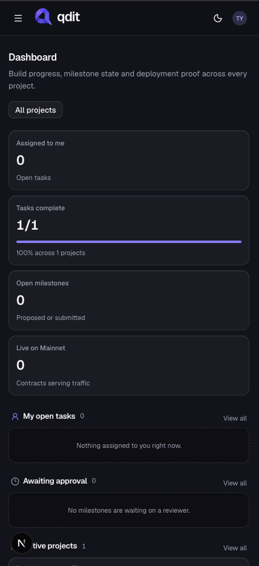
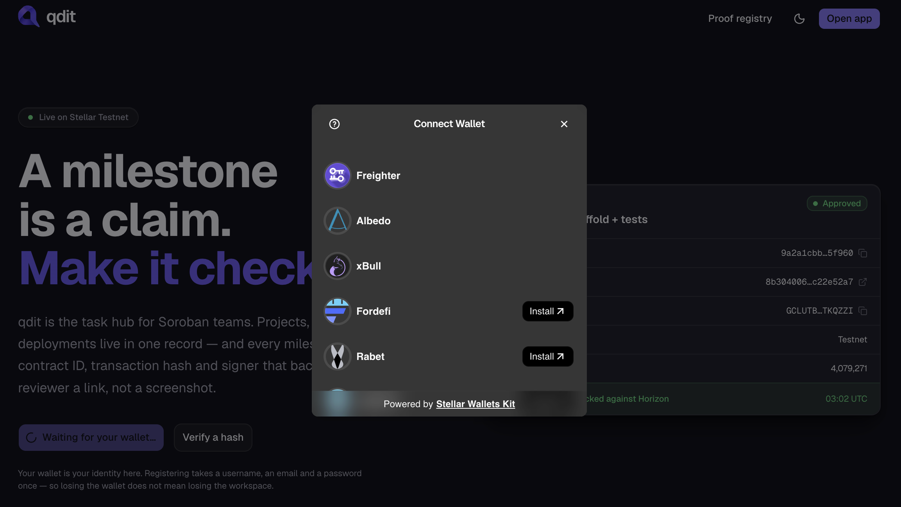
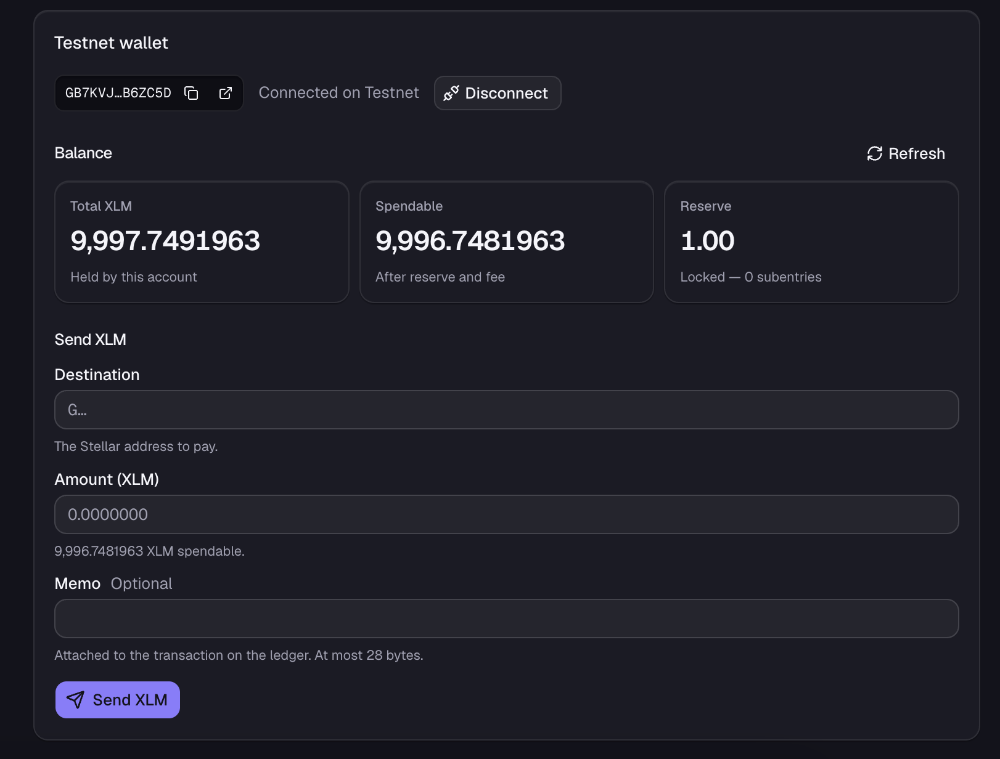
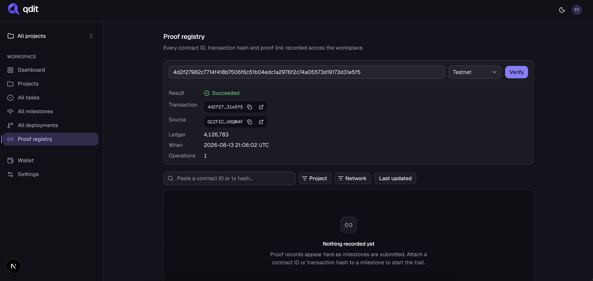
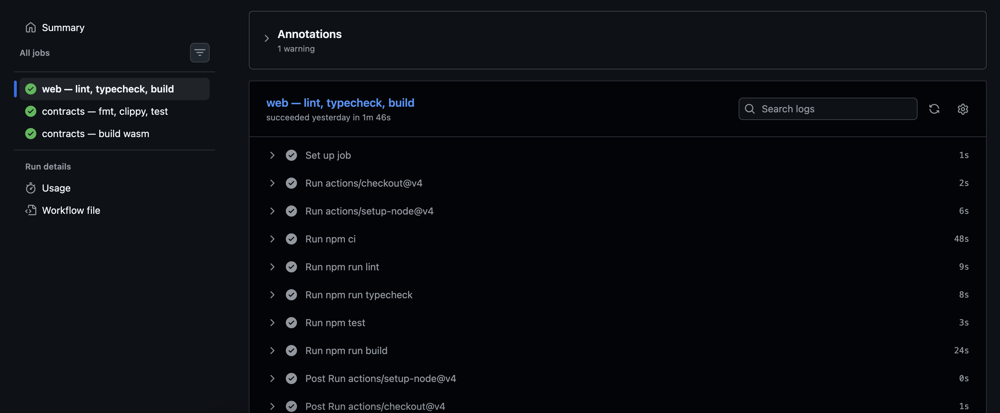
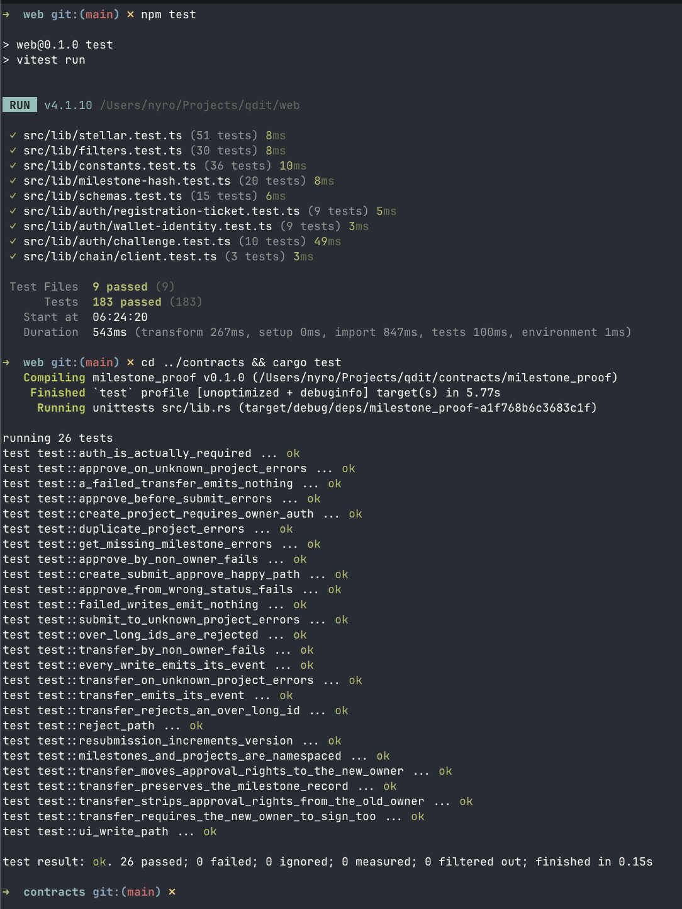

<p align="center">
  
</p>

<h1 align="center">qdit</h1>

<p align="center">
  <strong>Builder operations → milestone approvals → on-chain proof</strong>
</p>

<p align="center">
  Run projects, tasks, milestones and deployments in one hub, then anchor every
  milestone's proof hash on <a href="https://stellar.org">Stellar</a> so “approved vs
  actually shipped” is ledger-true.
</p>

<p align="center">
  <a href="https://qdit.atalusan.com"></a>
  <a href="https://drive.google.com/file/d/1HBxmheFjpR25ik5xgWOF2vvOb32JEDIf/view?usp=sharing"></a>
  <a href="https://docs.google.com/presentation/d/1WNYg2brDl0bo-e9BkYXfPY9PjTfNUpK-TKeA31Zbid4/edit?usp=sharing"></a>
  <a href="https://docs.google.com/spreadsheets/d/1v0WbxRlLKGasNZS17Frk4Z6fQAndpqHD69dvzeUOtCQ/edit?usp=sharing"></a>
</p>

<p align="center">
  <a href="https://stellar.expert/explorer/testnet/contract/CBP3NKXCRUSOJLLUXDF5AIRNPAC6IL7TFJ2KCNL5A2GTKC2MB7M4OHVG"></a>
</p>

<p align="center">
  <a href="https://qdit.atalusan.com">Live demo</a> ·
  <a href="https://drive.google.com/file/d/1auBXzTmkw0Lvs7eq_WAqJD12DT0kDx1e/view?usp=sharing">Demo video</a> ·
  <a href="https://docs.google.com/presentation/d/1WNYg2brDl0bo-e9BkYXfPY9PjTfNUpK-TKeA31Zbid4/edit?usp=sharing">Pitch deck</a> ·
  <a href="https://docs.google.com/spreadsheets/d/1v0WbxRlLKGasNZS17Frk4Z6fQAndpqHD69dvzeUOtCQ/edit?usp=sharing">User feedback responses</a> ·
  <a href="https://stellar.expert/explorer/testnet/contract/CBP3NKXCRUSOJLLUXDF5AIRNPAC6IL7TFJ2KCNL5A2GTKC2MB7M4OHVG">Testnet contract on Stellar Expert</a>
</p>

<p align="center">
  
  
  
  
  
  
  
</p>

---

## Problem

Builder teams plan and track in Linear, Notion, Jira and a spreadsheet — then claim
delivery to a grant program, a client or a DAO.

That creates a trust gap:

- **“Done” is a database column.** Whoever owns the tracker can set it, unset it and
  backdate it, and nobody outside the workspace can tell.
- **Approval leaves no receipt.** A reviewer clicks approve; the evidence is a screenshot
  in a thread that outlives nothing.
- **Reporting is re-typed by hand.** The tracker, the grant report and the ledger are
  three separate stories about the same work.
- **Proof does not survive the team.** Vendor churn, a lapsed seat, a migrated workspace —
  the history goes with the tool.

In short: **project management has no independently verifiable record of what shipped.**

## Solution

**qdit** is a builder task hub — with Stellar as the proof layer.

| Layer | What it does |
| --- | --- |
| **Hub + board** | Projects, tasks, milestones, deployments and proofs, project-scoped by default |
| **Milestone state machine** | Each milestone tracks lifecycle: Proposed → Submitted → Approved \| Rejected |
| **Approval flow** | Approve/reject reserved to the project owner, enforced in Postgres *and* on chain |
| **milestone_proof (Soroban)** | Anchor SHA-256 milestone hashes on Stellar with owner auth |
| **Public receipt** | Proof digest, transaction hash, signer, network and ledger stay on screen and on the ledger — not in your database |

**Result:** every approved milestone leaves a hash anyone can verify against the ledger.
Approved vs shipped stops being a claim and becomes a fact.

## Vision

Most builder programs pay against milestones. Most milestones are attested by a
screenshot.

**qdit** closes the gap:

1. Run the real work — board, tasks, milestones, deployments — in one project-scoped hub.
2. Move a milestone through the contract's own state machine, so the database can never
   reach a state the chain refuses to reproduce.
3. Hash the milestone's state and anchor it on Soroban, signed by the builder's own wallet.
4. Publish the digest, not the data, so a reviewer can verify a milestone was in a given
   state at a given time without access to the workspace.

> Approved vs shipped becomes a receipt, not a marketing claim.

---

## Demo, deck and data

| Asset | Link |
| --- | --- |
| **Live app** — running on Stellar Testnet | [qdit.atalusan.com](https://qdit.atalusan.com) |
| **Demo video** — end-to-end walkthrough | [Watch on Google Drive](https://drive.google.com/file/d/1HBxmheFjpR25ik5xgWOF2vvOb32JEDIf/view?usp=sharing) |
| **Pitch deck** — 14 slides, problem → architecture → proof | [Open in Google Slides](https://docs.google.com/presentation/d/1WNYg2brDl0bo-e9BkYXfPY9PjTfNUpK-TKeA31Zbid4/edit?usp=sharing) |
| **User feedback** — 20 responses, wallet · email · name · rating · free text | [Open in Google Sheets](https://docs.google.com/spreadsheets/d/1v0WbxRlLKGasNZS17Frk4Z6fQAndpqHD69dvzeUOtCQ/edit?usp=sharing) |
| **Live testnet transaction** — `approve_milestone`, ledger 4126783 | [View on Stellar Expert](https://stellar.expert/explorer/testnet/tx/4d2f27982c7714f418b7506f6c51b04edc1a2976f2c74a05573d19173d31e5f5) |
| **Deployed contract** — `milestone_proof`, 6 functions | [View on Stellar Expert](https://stellar.expert/explorer/testnet/contract/CBP3NKXCRUSOJLLUXDF5AIRNPAC6IL7TFJ2KCNL5A2GTKC2MB7M4OHVG) |

---

## Features

### On-chain registry (`contracts/`)

- **Milestone proofs** — SHA-256 hash per `(project_id, milestone_id)`, `version` increments on every re-submission
- **Approval lifecycle** — `Proposed → Submitted → Approved | Rejected`, approve/reject reserved to the project owner
- **Owner auth** — every write requires `require_auth()`; a transfer requires **both** the outgoing and incoming owner
- **Persistent storage + TTL** — ~30-day threshold, extended to ~90 days on every write
- **Events** — `(qdit, register|transfer|submit|approve|reject)` with **indexed `project_id` topic**

### App (`web/`)

- Project-scoped **board**: tasks, milestones, deployments, proofs, drag-and-drop, role-gated controls
- Supabase Auth via **wallet sign-in (SEP-10)** + 30 RLS policies over 8 tables
- **Anchoring** and **payments** built browser-side: prepare → wallet signs → server verifies and submits
- `/wallet` — connect, disconnect, XLM balance from Horizon, send a Testnet payment
- Typed URL filter state, so a filtered view is shareable and survives a refresh

**Responsive down to phone width.** Below `lg` (1024px) the sidebar becomes a sheet behind
a menu button and every panel stacks to one column. List rows shed optional columns using
**container** queries rather than viewport breakpoints, because the same row renders
full-width on `/tasks` and inside a half-width dashboard panel:



### Data layer (`supabase/`)

- 11 plain-SQL migrations, 8 tables, 7 enums, triggers, indexes, 30 RLS policies
- `queries.ts` is the only read path; every function returns `Page<T>` so no view renders an unbounded list by accident
- `actions.ts` re-validates with the same zod schema the client used and returns `{ ok, error, fieldErrors }` instead of throwing

---

## Deployed contracts

The app runs against **testnet**. Mainnet is not deployed yet — the contract has no admin
address and no `upgrade` entry point, so that decision is deliberately still open.

### Stellar Testnet — sandbox

| Field | Value |
| --- | --- |
| **Network** | Stellar Testnet (`Test SDF Network ; September 2015`) |
| **Contract ID** | [`CBP3NKXCRUSOJLLUXDF5AIRNPAC6IL7TFJ2KCNL5A2GTKC2MB7M4OHVG`](https://stellar.expert/explorer/testnet/contract/CBP3NKXCRUSOJLLUXDF5AIRNPAC6IL7TFJ2KCNL5A2GTKC2MB7M4OHVG) |
| **CLI alias** | `milestone_proof` |
| **WASM hash** | `d4bbe221cbe9837cf277448d0fe3aa99cf0dd9213a98db15b671a34dadf2a8b4` |
| **Deployer** | `GC5N7WGWHHZEJ2PEIYAREWKGNQSWR3CME2HXBXKOJ65F3MPL27R774JZ` |
| **Size** | 10777 bytes optimized (11899 unoptimized) · 6 exported functions |

**Explorer links**

- [Contract on Stellar Expert](https://stellar.expert/explorer/testnet/contract/CBP3NKXCRUSOJLLUXDF5AIRNPAC6IL7TFJ2KCNL5A2GTKC2MB7M4OHVG)
- [Deploy transaction (Expert)](https://stellar.expert/explorer/testnet/tx/afcf108fc640fac527e474f9593c050712a9b860ea5351bc43951f465d780ddb)
- [WASM upload transaction (Expert)](https://stellar.expert/explorer/testnet/tx/1d1483f02b3e2233cb60d67ac4ad1e0fe57b96b5fa43d71867daf5c5d7d92cf6)

The **WASM hash is the point of that table**: anyone can rebuild this source with
`stellar contract build` and check the hash matches what is deployed. If it does not,
the deployed bytes are not this code.

Deployment is **not** upgradable — no admin address, no `upgrade` entry point, by choice.
A bug means deploying a new contract id and migrating the `chain_contract_id` the app
stores per project. That migration is near-free while `projects.chain_contract_id` is null
everywhere and `milestone_anchors` is empty, and grows with every registered project.

### Verified live on this deployment

Beyond the 26 contract unit tests, checked against the deployed contract itself:

- `create_project_ref` emits its event and sets the owner.
- `transfer_project_owner` **cannot be assembled without the incoming owner's signature** —
  the CLI refuses with `Missing signing key for account G…`. That is the two-signature rule
  holding in production, not just in `mock_auths`.
- After a transfer, the previous owner gets `Error(Contract, #4)` `NotAuthorized` on the
  same project, so rights genuinely move rather than being shared.

> A caution learned while checking this: `stellar contract invoke` silently signs **every**
> auth entry it holds a local key for. A transfer between two identities that are both in
> your keystore therefore looks like it needed one signature. It did not — use an address
> you hold no key for to see the requirement.

---

## User feedback — survey responses

Twenty testers ran the live app on Stellar Testnet on 13–14 August 2026 and filled the
feedback form (wallet address, email, name, product rating, free-text answer to *“what
would you change or improve?”*).

📊 **[Open the responses in Google Sheets](https://docs.google.com/spreadsheets/d/1v0WbxRlLKGasNZS17Frk4Z6fQAndpqHD69dvzeUOtCQ/edit?usp=sharing)**

| Sheet | Contents |
| --- | --- |
| `Form Responses 1` | Timestamp · email · name · Stellar wallet · rating (1–5) · free-text feedback |

### Results

| Metric | Value |
| --- | --- |
| Responses | **20 / 20** |
| Average rating | **3.70 / 5** |
| Promoters (4–5) | 11 (55%) |
| Passives (3) | 6 (30%) |
| Detractors (1–2) | 3 (15%) |

| Rating | Count | Share |
| -: | -: | -: |
| ★★★★★ | 7 | 35% |
| ★★★★☆ | 4 | 20% |
| ★★★☆☆ | 6 | 30% |
| ★★☆☆☆ | 2 | 10% |
| ★☆☆☆☆ | 1 | 5% |

**What testers liked:** the `/proofs` verifier (“pasted my tx hash in /proofs and it came
back Succeeded with the ledger number, that part is genuinely cool”), the receipt that
outlives a session (“receipt survived a refresh and a re login which i did not expect”),
the three-tile balance (“the spendable vs total thing on the wallet page is nice”), and
the state machine behaving exactly as documented — reject, resubmit, `version` 2, approve.

**What hurt the score:** nothing on chain. Every rating below 3★ is a communication gap —
a rejection with no reason attached, a submission sitting silent for two days, a member
invite with no delivery, and a cold start that needs Freighter, the right network and
Friendbot with none of it written down. Not one tester reported a wrong chain result.

| Theme | Mentions | Worst rating raising it |
| --- | -: | -: |
| Status changes are silent — no notification, no email | 5 | 1★ |
| Rejection carries no reason, resubmit is hidden | 3 | 2★ |
| Cold start undocumented — Freighter, testnet, Friendbot | 3 | 1★ |
| Nothing shareable with an outside reviewer (login wall) | 2 | 3★ |
| Fees invisible before signing; mainnet cost unknown | 2 | 4★ |
| Anchor state not on the board; no version history | 2 | 4★ |
| Wallet-only sign-in blocks non-crypto teammates | 1 | 5★ |
| Member invite sends nothing | 1 | 2★ |
| Owner handover needs the CLI | 1 | 5★ |
| Mobile density, light-mode contrast, slow loads | 3 | 3★ |

---

## Next phase — what we build from this feedback

Each item is scoped from the responses above, collected against
[`19cff6b`](https://github.com/TyronVT/qdit/commit/19cff6b) — the commit live at
`qdit.atalusan.com` during the test.

### 1. A rejection has to say why (3 mentions, both 2★ responses)

> “my submit got rejected and the app just says rejected. thats it. no reason no comment
> nothing. i had to message the owner and ask bro what did i do wrong”
> “theres now a permanent public record that says i failed and literally nothing anywhere
> that says why, and i PAID a fee to put it there”

- Reviewer comment on reject and approve, stored in Postgres and covered by the milestone hash
- Resubmit becomes a visible button on a rejected milestone — today it hides inside the status-badge dropdown, and testers read the rejection as a dead end
- The chain keeps only the digest, so a reason costs no extra ledger space — it changes what the hash commits to, which means `milestone-hash.ts` and its pinned test change with it

### 2. Tell people when the status changes (5 mentions, including the 1★)

> “i submitted it 2 days ago and its still just sitting there. no email no notif nothing,
> i dont even know if anyone saw it”
> “no notif when it flipped, found out by accident”

- Owner gets a notification on submit; submitter gets one on approve/reject
- In-app inbox first, email second — both read the same event, so a missed email is recoverable
- A submitted milestone needs an age indicator, so “waiting” is visible without asking

### 3. A link an outside reviewer can open (2 mentions)

> “i still cant send our grant person a link they can just open. everything needs a login
> so im back to screenshots which is the exact thing this is supposed to kill”
> “publishing the hash only is the right call, i can verify without touching ur db. but i
> cant give an outside reviewer anything that isnt behind a login. public view please”

- Public audit page per project, readable logged out: milestone, status, digest, transaction, ledger
- It publishes the digest, not the data — the same thing the chain already carries
- Rate-limit `/api/verify-tx` in the same change; a public page is the moment that matters. `/api/balance` stays behind the auth gate so it cannot be used as an open proxy

### 4. Survive a cold start (3 mentions, the 1★ and a 5★)

> “took me almost an hour just to get IN. installed freighter, wrong network, then it kept
> saying account doesnt exist, then someone in the gc told me abt friendbot which is not
> written anywhere”
> “watched a friend try it cold and he was stuck on connect wallet for 15 mins thinking
> the site was broken. just add a 3 step checklist before the connect button”

- Three-step checklist on the landing page before the connect button: install Freighter → switch to Testnet → fund from Friendbot
- Detect the wrong network and say so — “account does not exist” today means the wallet is on mainnet, and one tester nearly quit over it
- The `funded: false` state already links Friendbot; that link has to appear before the failure, not after

### 5. Email sign-in, wallet when it is needed (1 mention, from a 5★)

> “my only real issue is wallet only login. i tried getting our ops person on it and she
> noped out at install a browser extension… rn the crypto part is a wall at the front door
> instead of a feature”

- Email/password sign-in, wallet linked later at the first anchor
- The address is already bound once at registration and never changes — linking later keeps that rule, it only moves when it happens
- Anchoring stays additive, so an unlinked member can still run the board

### 6. Show the chain state everywhere (2 mentions)

> “board doesnt show anything about whats anchored, had to click into every milestone one
> by one. just put a lil badge on the cards”
> “the whole point for me is showing someone hey v1 got rejected on this date and v2 got
> approved on this date… the data is on chain already u just arent reading it back”

- Anchor and `stale` badges on board cards and the dashboard, not only on the milestone
- Version history per milestone read back from the ledger rather than the database
- Cost before the wallet popup: simulation already returns the fee, so show it (“show the fee before the popup pls”)

### 7. Invitations, handover and mainnet cost

> “i tried adding my co op partner as a member and it just said he has no account. ok?? so
> send him one?”
> “handing over a project needs the CLI, nobody on my team is opening a terminal for that”
> “if we run 40 milestones a quarter thats a real number and rn i cant even estimate it bc
> the app never shows a cost”

- `add_project_member_by_*` grants access but delivers nothing. Adding delivery also lets the email path invert: send to any address and stop answering the account-existence question
- `transfer_project_owner` needs two signatures, so the UI has to hold a half-signed envelope between two people. Until then a wrong-but-controlled owner is fixable only from the CLI
- Document mainnet fee estimates per milestone lifecycle before the mainnet deploy

### 8. Mobile + polish (3 mentions)

- Board density on phone — “on phone the board is cramped and i keep hitting the wrong row”
- Light-mode contrast pass, starting with the grey hash text one tester called unreadable
- Load time on the board, keyboard shortcuts

**Priority order:** rejection reasons → notifications → public audit page + rate limiting →
cold-start onboarding → email sign-in → chain visibility → invitations and handover →
mobile, with the upgrade path settled before any mainnet deploy. Communication gaps come
first: they produced every score below 3★ while the contract itself was never the
complaint.

---

## Stellar wallet integration (testnet)

End-to-end wallet flow on **Stellar Testnet**, signed with Freighter and verified
on-chain. Source images live in
[`docs/screenshots/stellar_wallet_integration/`](docs/screenshots/stellar_wallet_integration).

| Field | Value |
| --- | --- |
| Network | Stellar Testnet (`Test SDF Network ; September 2015`) |
| Wallet | [`GCZFICVAJ4KEI45HPFDI27HH4SG7XBYNUDSJRKKRIERF6GLY3HV6QM4F`](https://stellar.expert/explorer/testnet/account/GCZFICVAJ4KEI45HPFDI27HH4SG7XBYNUDSJRKKRIERF6GLY3HV6QM4F) |
| Contract | [`CBP3NKXCRUSOJLLUXDF5AIRNPAC6IL7TFJ2KCNL5A2GTKC2MB7M4OHVG`](https://stellar.expert/explorer/testnet/contract/CBP3NKXCRUSOJLLUXDF5AIRNPAC6IL7TFJ2KCNL5A2GTKC2MB7M4OHVG) |

### 1. Wallet setup

Freighter installed, switched to **Stellar Testnet**, and funded from Friendbot
with **10,000 XLM**.


| Field | Value |
| --- | --- |
| Network | Stellar Testnet |
| Account | [`GCZFICVAJ4KEI45HPFDI27HH4SG7XBYNUDSJRKKRIERF6GLY3HV6QM4F`](https://stellar.expert/explorer/testnet/account/GCZFICVAJ4KEI45HPFDI27HH4SG7XBYNUDSJRKKRIERF6GLY3HV6QM4F) |
| Created | 2026-08-13 20:51:51 UTC (Friendbot) |
| Initial balance | 10,000 XLM |

The app links the same Friendbot for an unfunded account rather than erroring —
`friendbotUrl()` in `src/lib/wallet.ts`, reached from the `funded: false` state.

### 2. Wallet connection

The wallet is the credential: connecting it is how you sign in, and an address
the app has never seen leads to `/register` rather than to a session.

**Wallet options available.** `connectWallet()` opens the kit's chooser rather than
hard-wiring one extension — Freighter, Albedo and xBull are detected and ready, and the
ones that are not installed offer an install link instead of failing silently:



**Wallet connected.** Once a wallet is chosen, `/wallet` shows the connected address read
back from the extension, the network it is on, and a disconnect control:



The landing page before connecting, for contrast — the wallet is the only way in:


| Behaviour | Code |
| --- | --- |
| **Connect** — opens the kit's chooser, returns the public key | `connectWallet()` in `src/lib/wallet.ts` |
| Challenge exchange — SEP-10 signature, then a Supabase session | `src/app/api/auth/wallet/` |
| **Disconnect** — drops the kit's stored address; sign-out does both | `disconnectWallet()`, called from `/wallet` and from sign-out |
| Live address changes | `onWalletState()` (kit `STATE_UPDATED` event) |
| Connected address, balance and send form | `/wallet` — `src/app/(app)/wallet/page.tsx` |

The address on `/wallet` is read back from the wallet rather than stored, so the
page cannot claim a connection the extension does not agree with.
`@creit.tech/stellar-wallets-kit` is imported inside each function because it
touches `localStorage` during module evaluation, which breaks server rendering
of client components.

Sessions themselves stay with Supabase: a wallet session is an ordinary one with an
ordinary `auth.uid()`, and no RLS policy has ever seen a wallet. The address is bound
to the account once, at registration, and cannot be changed afterwards.

### 3. Balance handling

The connected account's XLM balance, read from testnet Horizon by `GET /api/balance` and
shown as **three tiles rather than one** — Total, Spendable and Reserve:


The same account confirmed independently on Stellar Expert:


| Field | Value |
| --- | --- |
| Balance | `9,999.9059307 XLM` — 10,000 minus fees for 3 payments |
| Total payments | 3 |
| Reported as | `balance`, `reserve`, `spendable` |

Three figures, not one: the protocol will not let an account drop below a
minimum tied to its subentry count, so `spendable` — balance minus reserve minus
fee headroom — is the only one that answers “how much can I send”, and it is the
number the send form enforces. A 404 from Horizon comes back as `funded: false`
rather than an error, because on Testnet that is one Friendbot click from being
funded.

Amounts are `bigint` stroops throughout (`src/lib/stellar.ts`). Seven decimal places do
not survive a round trip through a float, and a rounding error in a balance is a wrong
balance.

### 4. Transaction flow

A milestone approval anchored on-chain — `approve_milestone` invoked on the
deployed `milestone_proof` contract, signed in the browser with Freighter:


| Field | Value |
| --- | --- |
| **Status** | ✅ Successful |
| **Transaction hash** | [`4d2f27982c7714f418b7506f6c51b04edc1a2976f2c74a05573d19173d31e5f5`](https://stellar.expert/explorer/testnet/tx/4d2f27982c7714f418b7506f6c51b04edc1a2976f2c74a05573d19173d31e5f5) |
| Ledger | 4126783 |
| Processed | 2026-08-13 21:08:02 UTC |
| Source account | [`GCZFIC…V6QM4F`](https://stellar.expert/explorer/testnet/account/GCZFICVAJ4KEI45HPFDI27HH4SG7XBYNUDSJRKKRIERF6GLY3HV6QM4F) |
| Invoked | `approve_milestone(project_id, milestone_id, approver)` on [`CBP3NKXC…MB7M4OHVG`](https://stellar.expert/explorer/testnet/contract/CBP3NKXCRUSOJLLUXDF5AIRNPAC6IL7TFJ2KCNL5A2GTKC2MB7M4OHVG) |
| Max fee | 0.0020525 XLM |
| Fee charged | 0.0010703 XLM |
| Transaction size | 976 bytes |

**The result is shown back to the user, not just written to a ledger.** The proof registry
at `/proofs` verifies any transaction hash against Horizon and renders the outcome in the
app — result, transaction, source account, ledger, timestamp and operation count, each
hash carrying a copy button and a link to the explorer:



`Succeeded` is asserted, not assumed: a transaction can be included in a ledger and still
have failed, so `/api/verify-tx` reports the two states separately rather than treating
"found" as an endorsement. The milestone row keeps the same receipt after anchoring —
a transaction that leaves nothing behind is indistinguishable from one that never
happened, so the hash stays put rather than flashing past in a toast.

Failures are shown the same way. Simulation runs *before* the wallet is asked to
sign, so a contract error surfaces as a message instead of a paid-for failed
transaction, and a rejected signature is reported as a rejection
(`isRejectedError()`) rather than as a crash.

Payments split the same way anchoring does, and for the same reason — the key is in the
browser:

```text
preparePayment  → server: validate, load the account, build unsigned XDR
(wallet)        → browser: sign the XDR string, nothing else
sendPayment     → server: re-verify the envelope, submit to Horizon
```

`assertPayment` re-derives the destination, amount, asset and source from the signed
envelope before submitting. A wallet signs whatever it is handed, and the client could
have swapped the string — so the receipt on screen cannot describe a different
transaction from the one that was sent. Paying an address that does not exist yet is
silently a `createAccount` rather than a `payment`; nothing about a payment is written
to Postgres, because the ledger is the record.

---

## Tech stack

| Layer | Package | Badge |
| --- | --- | --- |
| Smart contracts | [soroban-sdk](https://crates.io/crates/soroban-sdk) `27.0.4` |  |
| Contract language | [Rust](https://www.rust-lang.org/) — `wasm32v1-none` |  |
| CLI / deploy | [Stellar CLI](https://developers.stellar.org/docs/tools/cli) `27.x` |  |
| Frontend | [Next.js](https://nextjs.org/) `16` + [React](https://react.dev/) `19` |  |
| Language | [TypeScript](https://www.typescriptlang.org/) |  |
| Database + auth | [Supabase](https://supabase.com/) — Postgres, RLS, `@supabase/ssr` |  |
| Chain client | [@stellar/stellar-sdk](https://www.npmjs.com/package/@stellar/stellar-sdk) |  |
| Wallet | [@creit.tech/stellar-wallets-kit](https://www.npmjs.com/package/@creit.tech/stellar-wallets-kit) + Freighter |  |
| Styling | [Tailwind CSS](https://tailwindcss.com/) `v4` + [shadcn/ui](https://ui.shadcn.com/) on Radix |  |
| Forms | [react-hook-form](https://react-hook-form.com/) + [zod](https://zod.dev/) `4` |  |
| Tests | [Vitest](https://vitest.dev/) + [Playwright](https://playwright.dev/) |  |
| Fonts | Geist · Geist Mono |  |

---

## Repository layout

```text
qdit/                            # git repo root
├── web/                         # PRIMARY app (Next.js hub + wallet + anchoring)
│   ├── src/app/                 # routes: (app) shell, api/, login, register
│   ├── src/lib/                 # queries · actions · filters · wallet · chain/
│   └── e2e/                     # Playwright specs + seed contract
├── contracts/                   # Soroban milestone_proof (Rust workspace)
├── supabase/                    # SQL migrations, RLS policies, local config
├── docs/screenshots/            # Wallet integration evidence
├── materials/                   # Brand source material
├── .github/workflows/
└── README.md
```

---

## Architecture

```text
   Browser                  web/ (Next.js server)          Stores
 ┌────────────┐            ┌────────────────────┐      ┌──────────────────┐
 │ Freighter  │  sign XDR  │ queries · actions  │ RLS  │ Supabase Postgres│
 │  wallet    │◄──────────►│ api/balance        ├─────►│ 8 tables · 30    │
 └─────┬──────┘            │ api/auth/wallet    │      │ policies         │
       │ SEP-10            └─────────┬──────────┘      └──────────────────┘
       │                             │ build · simulate · verify · submit
       │                             ▼
       │                   ┌────────────────────┐      ┌──────────────────┐
       └──────────────────►│ Soroban RPC        ├─────►│ milestone_proof  │
                           │ Horizon            │      │ (Stellar Testnet)│
                           └────────────────────┘      └──────────────────┘
```

Because the wallet signs in the browser, anchoring is three steps rather than one server
action:

```text
prepareMilestoneAnchor   server: authorize, hash, build + simulate → XDR
  ↓
signTransaction          browser: the wallet signs that string, nothing else
  ↓
submitMilestoneAnchor    server: verify the envelope, submit, poll, record
```

**Step 3's verification is not optional.** Without it a user could sign an arbitrary
transaction and have the server record it as an authentic anchor. `assertInvocation` in
`src/lib/chain/client.ts` parses the envelope and refuses anything that is not exactly one
`invokeHostFunction` against the expected contract and function, and `signer_address` is
read out of the verified transaction rather than from `profiles.wallet_address`.

The chain never sees a milestone's content — only a SHA-256 of it, so anyone can verify a
milestone was in a given state at a given time without being handed the data.
`src/lib/milestone-hash.ts` defines exactly what that digest covers; changing it
invalidates every anchor already on the ledger, silently, so `milestone-hash.test.ts` pins
the encoding.

Anchoring is **additive**: it never writes `milestones.status`. A milestone can be approved
in the app and not yet anchored, or anchored under a hash that no longer matches — the UI
shows both and marks a mismatch `stale` rather than hiding it. Making the chain write a
precondition would mean nobody without a funded wallet could move a milestone at all.

---

## Contract interface

| Function | Auth | Description |
| --- | --- | --- |
| `create_project_ref(project_id, owner)` | owner | Register a project on chain; errors `ProjectExists` (1) if the id is taken |
| `transfer_project_owner(project_id, current_owner, new_owner)` | **both** | Hand a project over; milestone records untouched |
| `submit_milestone_proof(project_id, milestone_id, submitter, proof_hash)` | submitter | Sets status `Submitted`, increments `version`, stamps the ledger timestamp |
| `approve_milestone(project_id, milestone_id, approver)` | approver = owner | Only valid from `Submitted` |
| `reject_milestone(project_id, milestone_id, approver)` | approver = owner | Only valid from `Submitted` |
| `get_milestone_status(project_id, milestone_id)` | none | Read anchored milestone state; errors `MilestoneNotFound` (3) |

**Milestone statuses:** `Proposed` · `Submitted` · `Approved` · `Rejected` — a rejected
milestone may be re-submitted; an approved one is terminal.

**Errors:** `ProjectExists = 1` · `ProjectNotFound = 2` · `MilestoneNotFound = 3` ·
`NotAuthorized = 4` · `InvalidStatus = 5` · `IdTooLong = 6`

**Events:** topic 0 is always `qdit` so one predicate filters the contract; topic 2 is the
indexed `project_id` so a consumer can watch one project without decoding each body.
Declared with `#[contractevent]`, so they appear in the contract spec and
`stellar contract bindings typescript` generates their types.

**Storage:** `persistent`; every write extends the TTL of every key it touches back out to
~90 days, topped up whenever fewer than ~30 remain.

**Ids are `String`, not `Symbol`** — the app's ids are 36-character UUIDs, and `Symbol`
caps at 32 with an alphabet excluding `-`. Ids are capped at 64 characters (`IdTooLong`)
so a caller cannot make the ledger carry an unbounded key.

**A transfer needs two signatures** — the outgoing signature proves the right to give the
project away; the incoming one proves the destination is an address someone actually
controls. Requiring only the first would let a single typo strand a project forever, since
there is no admin and no upgrade path. It does **not** recover a lost key: a lost key
cannot sign as `current_owner`.

---

## Quick start — app (`web/`)

The app is deployed at **[qdit.atalusan.com](https://qdit.atalusan.com)** — connect a
Freighter wallet on Testnet and it works without any of the setup below. To run it
locally:

Prerequisites: Node.js 20.9+, a Supabase project (or the
[Supabase CLI](https://supabase.com/docs/guides/cli) for a local stack), and
[Freighter](https://www.freighter.app/) set to **Stellar Testnet**.

```bash
cd web                         # install from web/, not the repo root
cp .env.example .env.local     # fill in your Supabase project values
npm install
npm run dev
```

Open [http://127.0.0.1:3000](http://127.0.0.1:3000) → `/login` → connect Freighter →
register a username and email. Fund the account from Friendbot if it is new, then
`/wallet` shows the balance and can send a Testnet payment.

```bash
npm run lint
npm run typecheck
npm test                       # Vitest
npm run build
```

`npm install` from the repo root *appears* to work, because Node resolves upward.
Install from `web/`.

Database, with the Supabase CLI:

```bash
supabase start           # local stack
supabase db reset        # apply migrations + seed
```

Migrations are plain SQL under `supabase/migrations/`. Apply new ones with the CLI, which
writes `supabase_migrations.schema_migrations`; pasting SQL into the dashboard editor does
not, and the repo then has no record of a change that is live.
`src/lib/types/database.ts` is **hand-written** — change it in the same commit as any
migration, because nothing regenerates it.

> **Never apply `supabase/seed.sql` to a hosted project.** It creates local-stack accounts
> with a plaintext password and its header says so.

End-to-end tests build and serve the app themselves on port 3100, against the real
Supabase project with RLS enforced — there are no fixtures, and credentials come from
`E2E_EMAIL` / `E2E_PASSWORD` in `.env.local`:

```bash
cd web
npx playwright install chromium   # once
npm run test:e2e
```

### Network selection

The app defaults to **testnet**. Two env vars decide the chain layer:

```bash
NEXT_PUBLIC_STELLAR_NETWORK=testnet
NEXT_PUBLIC_MILESTONE_PROOF_CONTRACT_ID=CBP3NKXCRUSOJLLUXDF5AIRNPAC6IL7TFJ2KCNL5A2GTKC2MB7M4OHVG
```

**Leave the contract id empty and anchoring is absent rather than broken** — the controls
simply do not render, which is how CI builds it.

| Variable | Value |
| --- | --- |
| `NEXT_PUBLIC_SUPABASE_URL` | Supabase project URL |
| `NEXT_PUBLIC_SUPABASE_PUBLISHABLE_KEY` | publishable key — RLS is what protects the data, not this key |
| `NEXT_PUBLIC_SITE_URL` | `http://127.0.0.1:3000` locally |
| `NEXT_PUBLIC_STELLAR_NETWORK` | `testnet` |
| `NEXT_PUBLIC_MILESTONE_PROOF_CONTRACT_ID` | deployed contract id, or empty to disable anchoring |
| `SUPABASE_SECRET_KEY` | server-only; required for wallet sign-in |
| `STELLAR_AUTH_SERVER_SECRET` | server-only; signs the SEP-10 challenge. An ordinary keypair, generated once and never funded |

Every variable is documented inline in [`web/.env.example`](./web/.env.example).
`NEXT_PUBLIC_*` values are inlined at build time, so changing them in a hosting dashboard
has no effect until a new build runs — redeploy after editing them.

---

## Quick start — contract

Prerequisites:

- Rust stable + `rustup target add wasm32v1-none`
- [Stellar CLI](https://developers.stellar.org/docs/tools/cli) 27.x

```bash
cd contracts
cargo test
cargo clippy --all-targets -- -D warnings
cargo fmt --all --check

stellar contract build
```

WASM: `contracts/target/wasm32v1-none/release/milestone_proof.wasm`

`clippy`, `rustfmt` and the `wasm32v1-none` target all come from
`contracts/rust-toolchain.toml`, so a `rustup`-managed install picks them up on first use.
A bare `cargo` (Chocolatey, distro package) can run `cargo test` — the tests register the
contract natively rather than as WASM — but nothing else.

### Deploy (testnet)

```bash
# one-time identity
stellar keys generate qdit-deployer --network testnet --fund

stellar contract deploy \
  --wasm target/wasm32v1-none/release/milestone_proof.wasm \
  --source qdit-deployer \
  --network testnet \
  --alias milestone_proof
```

The command prints the contract id (`C…`). Save it as
`NEXT_PUBLIC_MILESTONE_PROOF_CONTRACT_ID` in the app's environment.

### Deploy (mainnet)

Not deployed to mainnet yet — settle the upgrade path first. When it is, the command is
the same against `--network mainnet` with a funded real account. Simulate first; a
simulation is free and needs no key.

```bash
stellar contract deploy \
  --wasm target/wasm32v1-none/release/milestone_proof.wasm \
  --source-account <YOUR_KEY> \
  --network mainnet
```

### Invoke (live contract)

```bash
CONTRACT=CBP3NKXCRUSOJLLUXDF5AIRNPAC6IL7TFJ2KCNL5A2GTKC2MB7M4OHVG
OWNER=$(stellar keys address qdit-deployer)

PROJECT=8f14e45f-ceea-467a-9b7e-5a0dcbf1c8b2   # a real project uuid
MILESTONE=c9f0f895-fb98-4b1f-a1b3-8ee9a1d6c4e7

stellar contract invoke --id $CONTRACT --source qdit-deployer --network testnet -- \
  create_project_ref --project_id "$PROJECT" --owner "$OWNER"

stellar contract invoke --id $CONTRACT --source qdit-deployer --network testnet -- \
  submit_milestone_proof --project_id "$PROJECT" --milestone_id "$MILESTONE" \
    --submitter "$OWNER" --proof_hash <64-hex-chars>

stellar contract invoke --id $CONTRACT --source qdit-deployer --network testnet -- \
  approve_milestone --project_id "$PROJECT" --milestone_id "$MILESTONE" --approver "$OWNER"

stellar contract invoke --id $CONTRACT --source qdit-deployer --network testnet -- \
  get_milestone_status --project_id "$PROJECT" --milestone_id "$MILESTONE"
```

`--proof_hash` is bare hex with no `0x` prefix. Inspect the deployed interface at any time
with `stellar contract info interface --id $CONTRACT --network testnet`.

TypeScript bindings are generated from the deployed contract, never hand-written —
`src/lib/chain/bindings.ts` is ESLint-ignored and must be replaced wholesale:

```bash
stellar contract bindings typescript --network testnet \
  --contract-id $CONTRACT --output-dir /tmp/qdit-bindings
cp /tmp/qdit-bindings/src/index.ts web/src/lib/chain/bindings.ts
```

---

## CI

GitHub Actions (`.github/workflows/ci.yml`), three jobs:

1. **web** — `npm ci`, `npm run lint`, `npm run typecheck`, `npm test` (Vitest), `npm run build` with an empty contract id, so the build never depends on a deployed contract
2. **contracts** — `cargo fmt --all --check`, `cargo clippy --all-targets -- -D warnings`, `cargo test`
3. **wasm** — pinned Stellar CLI, `stellar contract build`, upload the artifact

Every job green on `main`, each step gated in order — a failed lint never reaches a build:



The Playwright suite is deliberately not in CI: it runs against the real hosted Supabase
project with RLS enforced, so it needs `E2E_EMAIL` / `E2E_PASSWORD` and a database that
write specs are allowed to mutate.

### Test output

```bash
cd web && npm test          # Vitest — pure logic, no browser or database
cd contracts && cargo test  # Soroban contract, registered natively
```



| Suite | Covers | Result |
| --- | --- | --- |
| Vitest — 9 files | Milestone state machine, filter round trip, strkey validators, milestone hash encoding, SEP-10 challenge, registration tickets, envelope assertions | **183 passed** |
| Soroban — `cargo test` | Auth rules, the approval state machine, two-signature transfer, event emission, id length limits, version counting | **26 passed** |
| Playwright — not in CI | Auth gate, every read, the write and approval flows, mobile nav | 140 passed, 1 skipped |

The milestone rules matter most: `updateMilestoneStatus` mirrors what `milestone_proof`
enforces on-chain, and a silent divergence between the two is the expensive kind, so
`constants.test.ts` pins the TypeScript transitions against the Rust implementation.

---

## Roadmap (near-term)

- [ ] Reviewer comment on approve/reject, and a visible resubmit button on a rejected milestone
- [ ] Notify on submit, approve and reject — in-app first, email second
- [ ] Settle the contract upgrade path, then deploy to mainnet
- [ ] Drive `transfer_project_owner` from the app rather than the CLI (two signatures, one UI)
- [ ] Public audit page per project — verify a milestone from the ledger, logged out
- [ ] Rate-limit `/api/verify-tx` before onboarding at any scale
- [ ] Surface anchor state on the board and dashboard, not only on the milestone
- [ ] Invitation delivery, so the email path can stop answering the account-existence question
